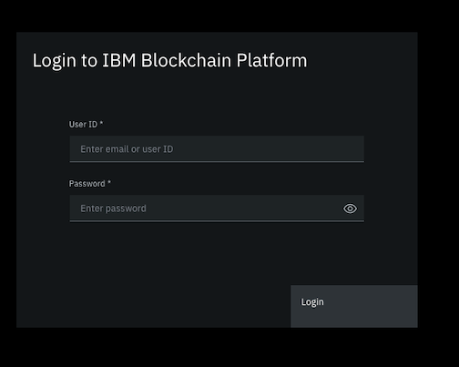
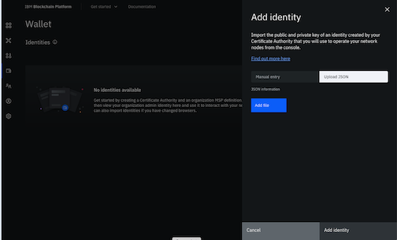
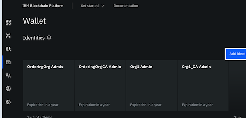
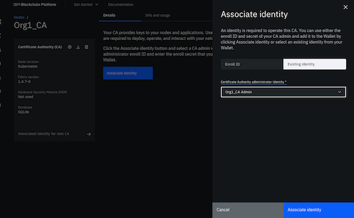
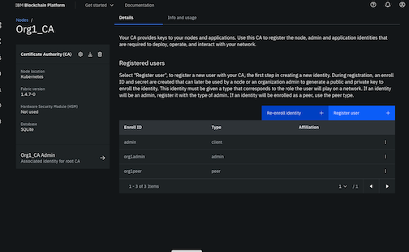
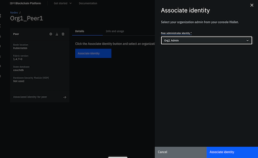
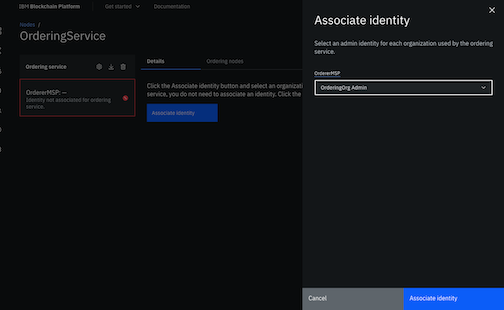

# Install IBPv2 Software on VPC cluster

This covers the use of Ansible to deploy the IBPv2 Console and the IBP Network resources.

1. [Ansible deployment architecture](#1-ansible-deployment-architecture)

2. [Get the kube config file](#2-get-the-kube-config-file)

3. [Deploy the IBP Console and Operator](#3-deploy-the-ibp-console-and-operator)

    3a) [Edit config files](#3a-edit-config-files)

4. [Deploying IBP the IBP Network](#4-deploying-ibp-the-ibp-network)

    4a) [Altering the 00-common-vars file](#4a-altering-the-00-common-vars-file)

    4b) [Altering the 02-org1-vars file](#4b-altering-the 02-org1-vars-file)

    4c) [Altering the 01-ordering-org-vars file](#4b-altering-the 01-ordering-org-vars-file)

    4b) [Deploy IBPv2 network resources](#4b-deploy-ibpv2-network-resources)

5. [Deploy IBPv2 network resources](#5-deploy-ibpv2-network-resources)

6. [Load Identities in Console](#6-load-identities-in-console)

## Getting started

### 1. Ansible deployment architecture

> Here is the structure of the Ansible deployment:
>
> * Ansible playbook is just used to create the initial IBP Console and install the IBP Operator.
>
>     The file for that is in the HA-IBP-Install directory:
>
>     <https://github.ibm.com/Healtcm/HA-IBP-Install.git>
>     
>     **Notes**: If you execute this runbook for Consent Manager, please download branch `icm-vpc`
>
> * Ansible Playbooks to create the IBP network _playbooks/playbook-files_ directory of the _HA-IBP-Install_ repo.
>
>     The repo contains the `.yaml` files that the docker container uses to create the IBPv2 network on the VPC Gen2 cluster. Using a script the `ansible-playbook` command runs creates the resources defined in the `.yml` files. These files call configuration `.yml` files where all the variables are defined.

### 2. Get the kube config file

**Step 2-1:**
>
> Delete the existing kubernetes config, `.pem` and `.bin` files. Otherwise you could connect to the wrong cluster. Which would be a bad thing, you could end up overwriting and existing network somewhere.
>
> For the IBP install you will need the kubernetes config files. They are usually in the following directory:
>
> `$HOME/.bluemix/plugins/container-service/clusters/<cluster name and id>/`
>
> You will need the three files that are there:
>
> ```sh
> ca-aaa00-ibp-ansible-cluster.pem
> kube-config-aaa00-ibp-ansible-cluster.yml
> ca.pem
> kube-config.yaml
> ```
>
> If you do not see the `kube-config.yaml` file copy and rename(or just rename) the `kube-config-<bunch of letters and numbers>.yml` file to `kube-config.yaml`.
>
**Step 2-2:**
>
> Copy the above files into the `playbooks` directory in the `HA-IBP-Install` project.
>
> ```sh
> cp -R $HOME/.bluemix/plugins/container-service/clusters/<cluster name and id>/* .
> ```

### 3. Deploying IBP Console

---

#### 3a) Edit config files

**Step 3a-1:**
>
> Alter the `playbooks/install-ibp.yml` file to reflect the values for the cluster.
>
**Step 3a-2:**
>
> Replace `<image_registry_password>` with your IBM Blockchain Platform entitlement key.
>
**Step 3a-3:**
>
> Replace `<image_registry_email>` with the email address of your IBMid account.
>
**Step 3a-4:**
>
> Replace `<console_domain>` with the domain name of your Kubernetes cluster. So you need the original Ingress Subdomain which you can get with this:
>
> ```sh
> ibmcloud ks cluster get --cluster $CID | grep Ingress
>```
>
> It should look something like what is below:
>
> ```sh
> Ingress Subdomain: cdtpayercmibpcluster.........0000.us-south.containers.appdomain.cloud
> ```
>
**Step 3a-5:**
>
> Replace `<console_email>` with the email address of the IBM Blockchain Platform console user that will be created during the installation process. You will use this email address to access the IBM Blockchain Platform console after installation.
>
**Step 3a-6:**
>
><span style="color:red">NOTE: For reinstall only</span>. If you are reinstalling the IBP network to match another IBP Network, either DEV, QA or Prod. Be certain the correct `operator_version: 20210112` and `product_version: 2.5.1` are set. See the CR for details.
>
---

#### 3b) Deploy the IBP Console and Operator

<span style="color:red">NOTE: DOUBLE CHECK THE ACL DIDN'T DELETE THE 443 PORT.</span>

> Once that image is done building you can run the command to install the `IBP Operator` and `IBP Console`.
>
> <span style="color:red">You must be in the ***playbooks*** directory when you run this first command.</span>
>
**Step 3b-1:**
>
> Change the permissions recursively in the `playbooks` directory from the `HA-IBP-Install` directory. Run:
>
> ```sh
> chmod -R 777 playbooks
> ```
>
> Then `cd` into the `playbooks` and run this command from the `playbooks` directory to launch the Ansible Playbook(double check to make sure you have saved everything):
>
> ```sh
> docker run --rm -v "$PWD:/playbooks" --env KUBECONFIG=/playbooks/kube-config.yaml ibmcom/ibp-ansible ansible-playbook -vvv /playbooks/install-ibp.yml
> ```
>
> You will then see a whole bunch of things happening, hopefully at the end of it you will see somthing like this:
>
> ```bash
> PLAY RECAP
> localhost                  : ok=34   changed=15   unreachable=0    failed=0    skipped=19   rescued=0    ignored=0
> ```
>
> If it all worked, go get a lottery ticket. You are very lucky.
>
> When the Ansible-Playbook is completed successfully it will display the URL for the Console. It should look something like this:
>
> `ibpsw-ibp-console-console.ibp-..............-0000.us-south.containers.appdomain.cloud`
>
**Step 3b-2:**
>
> Then use a browser you can by pass the ssl warnings in and log into the console with the email and password in the `playbooks/install-ibp.yml` file. It will require you to change the password. Login with the password set in the `install-ibp.yml` file. Save the new password to whatever password manager you are using.
>
>
>
> Log back in. You may have to wait up to 5 minutes for the new login to work. If it continues to fail you need to contact the Dev team.
>
**Step 3b-3:**
>
> Once you have changed the password, log back in to the console with the new password. If that worked you can move to the next section.
>
### 4. Deploying IBP the IBP Network

---

#### 4a) Altering the 00-common-vars file

The values for the Ansible configuration files for the standard deployment are part of the `HA-IBP-Install` repo. This chart designates how they map for the `beta` environment.

To get started you need to alter the following files:

 **Step 4a-1:**
>
> `playbooks/playbook-files/00-common-vars.yml`
>
> Use the console URL, without the `https://` and replace the `console_url` value.
>
> ```yaml
> console_url: ibpsw-ibp-console-console.......us-south.containers.appdomain.cloud
> ```
>
#### 4b) Altering the 02-org1-vars file

**Step 4b-1:**
>
> `playbooks/playbook-files/02-org1-vars.yml`
>
> Fill in the variables below.
>
> ```yaml
> api_endpoint: https://<url of the console>
> api_authtype: basic
> api_key: <Console login email>
> api_secret: <Console login password>
> ```
>
**Step 4b-2:**
>
> The balance of the usernames and passwords be changed for SP or Prod environments. In each place in the `playbooks/playbook-files/02-org1-vars.yml` file replace the value for each password. Designated below with `<new password>`.
>
> ```yaml
>
>     ca_admin_enrollment_id: cmcaadmin
>     ca_admin_enrollment_secret: <new password>
>     organization_admin_enrollment_id: cmorgadmin
>     organization_admin_enrollment_secret: <new password>
>     peer_enrollment_id: cmpeer
>     peer_enrollment_secret: <new password>
>     application_enrollment_id: cmapp
>     application_enrollment_secret: <new password>
> ```
>
**Step 4b-3:**
>
> Edit the PostgreSQL `datasource` node. The values in the example are in dot notation that correspond with the PostgreSQL Service Connection json file retrieved in the previous steps. Be certain to change the `dbname=CHANGE_THIS` to match the org/peer database you created in the PostgreSQL service.
>
> `datasource: host=<postgres.hosts.hostname> port=<postgres.hosts.port> user=<postgres.authentication.username> password=postgres.authentication.password> dbname=CHANGE_THIS sslmode=verify-full`
>
>
>  ```yaml
>
>     datasource: "datasource: host=<postgres.hosts.hostname> port=<postgres.hosts.port> user=<postgres.authentication.username> password=postgres.authentication.password> dbname=CHANGE_THIS sslmode=verify-full"
>
> ```
>
#### 4c) Altering the 01-ordering-org-vars file

**Step 4c-1:**
>
> `playbooks/playbook-files/01-ordering-org-vars.yml`
>
> Fill in the variables below:
>
> ```yaml
> api_endpoint: https://<url of the console>
> api_authtype: basic
> api_key: <Console login email>
> api_secret: <Console login password>
> ```
>
**Step 4c-2:**
> The balance of the usernames and passwords be changed for SP or Prod environments. In each place in the `playbooks/playbook-files/01-ordering-org-vars.yml` file replace the value for each password. Designated below with `<new password>`.
> Make sure you have altered the database name to match the orderer db in the following line:
>
> ```yaml
> ca_name: cmorderingorgca
> organization_name: "cmorderingorg"
> organization_msp_id: cmordmsp
> ca_admin_enrollment_id: cmcaordadmin
> ca_admin_enrollment_secret: <new password>
> organization_admin_enrollment_id: cmorderingorgadmin
> organization_admin_enrollment_secret: <new password>
> ordering_service_enrollment_id: cmorderingorgorderer
> ordering_service_enrollment_secret: <new password>
> ```
>
> <span style="color:red">NOTE: The `ordering_service_msp: cmordmsp` and `organization_msp_id: cmordmsp` must match. Otherwise the script will fail.</span>
>
**Step 4c-3:**
>
> Edit the PostgreSQL `datasource` node. The values in the example are in dot notation that correspond with the PostgreSQL Service Connection json file retrieved in the previous steps. Be certain to change the `dbname=CHANGE_THIS` to match the org/peer database you created in the PostgreSQL service.
>
> `datasource: host=<postgres.hosts.hostname> port=<postgres.hosts.port> user=<postgres.authentication.username> password=postgres.authentication.password> dbname=CHANGE_THIS sslmode=verify-full`
>
>  ```yaml
>
>     datasource: "datasource: host=<postgres.hosts.hostname> port=<postgres.hosts.port> user=<postgres.authentication.username> password=postgres.authentication.password> dbname=CHANGE_THIS sslmode=verify-full"
>
> ```
>
---

#### 5) Deploy IBPv2 network resources

**Note:** The mounted volume on the local needs to be given the correct permissions so Docker can write back to the ansible directories. For this you may need to set your repo directory permissions to give wolrd write:

```bash
chmod -R 777 <HA-IBP-Install dir>
```

**Step 5-1:**
>
> <span style="color:red">Run this command from inside the `playbook-files` directory will create the IBP Network:</span>
>
> ```sh
> docker run --rm -v "$PWD:/playbooks/playbook-files" ibmcom/ibp-ansible /playbooks/playbook-files/build_network.sh build
> ```
>
> This will take some time. The Ansible toolchain is creating the pods, svc's, ingresses and volumes for the IPB network.
>
**Step 5-2:**
>
> Once this command starts you will see a bunch of stuff going on. You can follow the progress with `kubectl` commands in a different terminal window that is logged into the cluster.
>
> `kubectl get deploy,po,svc,ing,pv,pvc -n ibpsw`
>
> Will show the progess of everything going on. Once you see that the script is finished and you see this with the pods:
>
> ```bash
>     pod/ibp-console-559d688df6-fsxqs            4/4     Running
>     pod/ibp-operator-6b9d64476-rwv28            1/1     Running
>     pod/orderingorgca-5f446cf64-4xcsz           1/1     Running
>     pod/orderingservicenode1-787bfcdfbd-wp25k   2/2     Running
>     pod/org1ca-6499d497c-jp68d                  1/1     Running
>     pod/org1peer1-6f6878bcb8-k8khm              5/5     Running
> ```
>
> You are in good shape.
>
**Step 5-3:**
>
> Now if you look in the `playbooks/playbook-files` directory you are going to see some new files that were created by the script. They should look something like this.
>
> ```bash
> cm-ca Admin.json
> cmOrderingOrgCA Admin.json
> cmorderingorg Admin.json
> cmorg Admin.json
> ```
>
> These are called `Identity files`. <span style="color:red">***Save those.*** Without them you can not use the console and will have to recreate them in the console which isn't fun.</span>  They are needed to reload the `Wallet` for anyone that wants to use the IBP Console. Treat them like passwords/ssh keys. Once everything is done running log back into the console.
> <span style="color:red">## You must also store the following files for later use to add new Orgs:</span>
>
> 1. playbooks/playbook-files/00-common-vars.yml
>
> 2. playbooks/playbook-files/01-ordering-org-vars.yml
>
> 3. playbooks/playbook-files/02-org1-vars.yml
>
> 4. And any other org files created later.
>
> If you are adding a second organization for NIH then run the [Add Org Network](docs/8_Add_Org_Network.md) to do so.

### 6) Load Identities in Console

> Attempt to connect to the `IBP Console` using the url from the previous command. A window like this should come up.
>
> 
>
> You will now need to add the `Identity files` files to the wallet and associate those entities.
>
> Go to the Wallet tab on the left and select it, then select `Add identity`.
>
> Once the menu comes up on the right side select the `Upload JSON` button.
>
> 
>
> Navigate to where the identity files are and select and upload them one at a time.
>
> Once all of them are loaded the `Wallet` tab should look like this:
>
> 
>
> Then you need to associate the Entity IDs with the various nodes.
>
> Click on the `Nodes` tab on the left and start with the `cmorg-ca` tile. Click on it and you will see a blue button labeled `Associate identity`, click on that button. The window below should pop up:
>
> 
>
> Click on the `Existing identity` tab and then select the `cmorg-ca Admin` and then the `Associate identity` button on the bottom right.
>
> Once that is done the cmorg-ca window should look like this:
>
> 
>
> Repeat the process with the `cmorderingorgca` tile. Only this time select the `cmorderingorgca Admin` in the drop down. The `OrderingOrg` window will look similar to the `cmorg-ca` window.
>
> Next click on the Peers node `Org1_Peer1` then click on the `Associate identity` button. From the drop down select `Org1 Admin`. Then click the `Associate identity` button on the bottom right.
>
> 
>
> Next click on the `Nodes` breadcrumb and then click on the `OrderingService` tile and repeat the `Associate identity` process only select the `OrderingOrg Admin` from the drop down this time.
>
> 
>
> Now you can deploy the smart contract.
