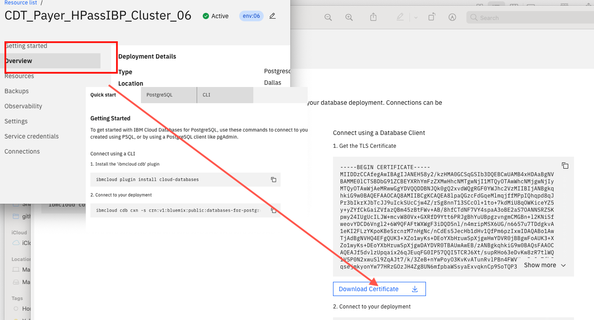
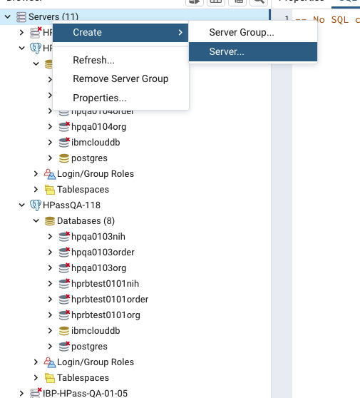
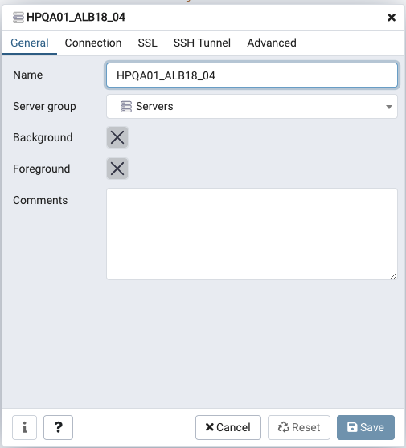
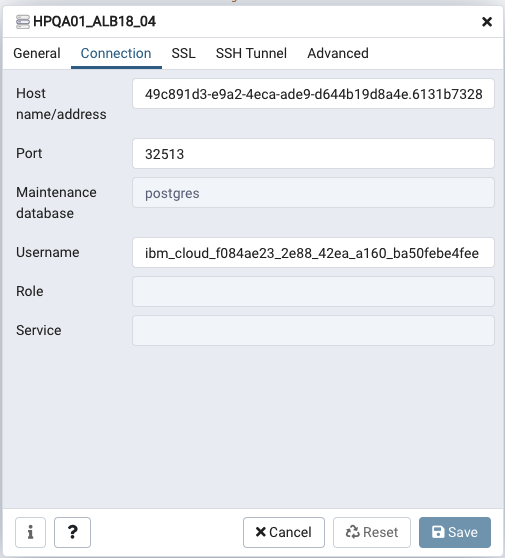
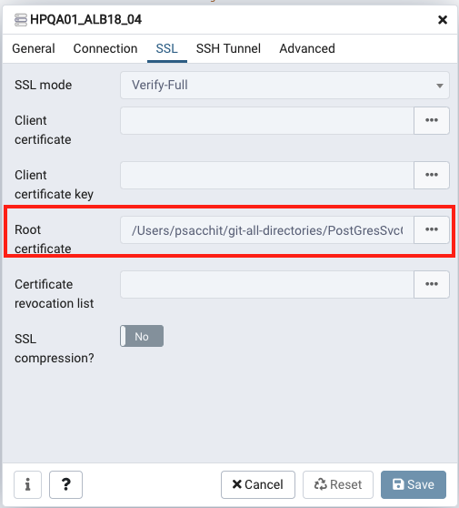
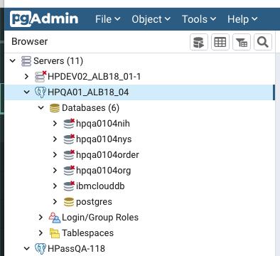
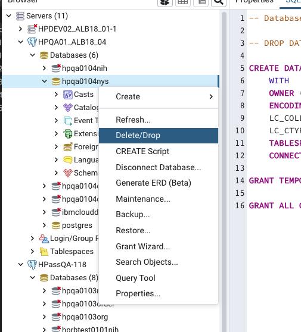

# Remove IBP Network

This run-book is for the deletion of High Availability IBP networks without removing the entire cluster.

Run through this entire run-book for each cluster listed in the ticket then move to the next cluster in the list.

<span style="color:red">**NOTE:**</span> To perform this task you must have **pgAdmin 4** installed on your workstation.

## Index

1. Install `pgAdmin 4`

2. Get the Postgres `Certificate Authority` DB info

3. Log into the Postgres Instance with PG4 Admin

4. Remove the IBP instance.

5. Clean up the Postgres `Certificate Authority` DBs

----------

### 1. Install pgAdmin 4

`If you have pgAdmin 4 installed skip to section 2.`

Install `pgAdmin 4` from here:

<https://www.pgadmin.org/download/>

Follow the installation directions on the site. On the OSX machines it will install an app that you run that will open a web page to localhost.

### 2. Get the Postgres `Certificate Authority` DB info

Before you re-install make certain the PostgreSQL databases are empty. Using the `pgAdmin` interface run the SQL to check that the `ordering` and `peer` tables are empty. You can get the table names from the configuration files.

The `ConfigMaps`(CM) for the `Certificate Authorities`(CAs) deployments will have the connection information for the `postgres` databases.

Using the IBM Cloud CLI commands log into the correct cluster.

<span style="color:red">**If you run these instructions in the wrong cluster it will be a bad day.**</span>

**Step 2-1:**

Get the cluster list by running this:

```sh
ibmcloud ks clusters
```

**Step 2-2:**

Find the cluster named in the ticket and log into that cluster.

```sh
ibmcloud ks cluster config --cluster <cluster ID or Name>
```

**Step 2-3:**

Then change to the namespace the IBP network is running in.

```sh
kubectl config set-context $(kubectl config current-context) --namespace=<ibp namespace>
```

**Step 2-4:**

Get the name of the `Config Maps` that contain the Postgres IBP information. Run the following command:

```sh
kubectl get cm -n <namespace ibp is in> | grep ca | grep overrides
```

That will give you the list of CMs that are for the CAs and have Postgres connection information in them.

The list should look something like this:

```sh
hpassorderingorgca-overrides                   5      32d
hpassorgca-overrides                           5      32d
nihorgca-overrides                             5      32d
```

**Step 2-5:**

Once you have the list of `Config maps(cm)` find the database names in each of the CMs with the following command:

```sh
kubectl get cm -o yaml <name of the cm> -n <namespace ibp is in> | grep dbname
```

It should spit out a `JSON` object, save the `username`, `password`, `port`, `host` and `dbname`. Look for the `dbname=<something>` node (it should be the first thing).

You should have a `dbname` in each `ConfigMap` with `overrides` in the name. Those `config maps` correspond to a `CA` object running in the cluster.

If there are 3 CAs in the cluster then there will be  3 of the follwing:

1. 3 override config maps

2. 3 databases in Postgres instance

Log into the IBM Cloud UI and get the certificate from the Postgres instance in the IBM Cloud Console check that the `host` url matches the `host` url from the `datasource` in the config map. See the following image:



The host name will also be there so you can be certain you are clearing the correct one.

**Step 2-5:**

Log into the Postgres instance from the `pgAdmin 4` that you get from the `host` url.

> a. Create a a database connection by right clicking on the `Service` tab on the left:
>
>
>
> b. In the pop up window in the `Name` field name the connection:
>
>
>
> c. Click on the connection tab and enter the `Host name`, `Port`, `Username` and `Password` information from the `datasource` information:
>
>
>
> d. Click on the `SSL` tab and click on the elipsis and find the SSL Cert you downloaded from the IBM Cloud Postgres console:
>
>
>
> f. Click `Save`
>
>You should then see the existing databases similar to the following image:
>
>
>
>For each of the Postgres databases from the `CMs` click on the database and select `Delete/Drop` and go through the prompts.
>
>
>
Once you have these cleared the Databases move on to clearing IBP.

### 2. Remove the IBP instance

There should be two `namespaces` that are related to the IBP installation, `ibpinfra-<deployment>` and `ibpsw-<deployment>`. Note them by running the following:

```sh
kubectl get ns
```

First make sure you are in the right cluster and the correct `namespace` to run the remove command you should be in the `ibpsw-<deployment>`:

```sh
kubectl config current-context
kubectl config set-context --current --namespace=<NAMESPACE>
```

Then run this to remove the IBP operator objects:

```sh
kubectl delete ibpca --all
kubectl delete ibppeer --all
kubectl delete ibporderer --all
```

NOTE: The IBP Operator is not the same as Kubernetes operators even though that is what the Operator is. Their naming could have been less confusing.

Then delete the Console and Operator:

```sh
kubectl delete deployment ibp-operator
```

```sh
kubectl delete ibpconsole --all
```

Then delete the namespaces used by the IBP Network there should be two.

```sh
kubectl delete namespaces ibpinfra-<deployment> and ibpsw-<deployment>
```

Once the namespace deletion is done the IBP instance is erased except the Postgres databases for the HA CAs. That is next.

----------

### 3. Clean up the Postgres `Certificate Authority` DBs

Before you re-install make certain the PostgreSQL databases are empty. Using the `pgAdmin` interface run the SQL to check that the `ordering` and `peer` tables are empty. You can get the table names from the configuration files you saved earlier.

Using the `pgAdmin 4` instance installed on your machine log into the correct Postgres server instance and clear the data from the tables.

WARNING: Triple check you are clearing the right database. Deleting the wrong one will irrevocably break the IBP instance attached to it and ruin your day.

#### Clearing the DB

Empty them with the following SQL commands.

Run this to check for the IBP tables:

```sh
SELECT table_name
FROM information_schema.tables
WHERE table_schema = 'public'
ORDER BY table_name;
```

You should see a list of tables: affiliations, certificates...

Run this to see if there is data in the `users` table:

```sh
SELECT * FROM users;
```

There should be some data there. The values are not important.

Then run this to delete the tables:

```sh
DROP TABLE IF EXISTS users
,affiliations
,certificates
,credentials
,revocation_authority_info
,nonces
,properties
```

Run the `SELECT` query again to be certain the tables are gone. Once that is done you are now ready to re-install IBP with the same Postgres credentials.
